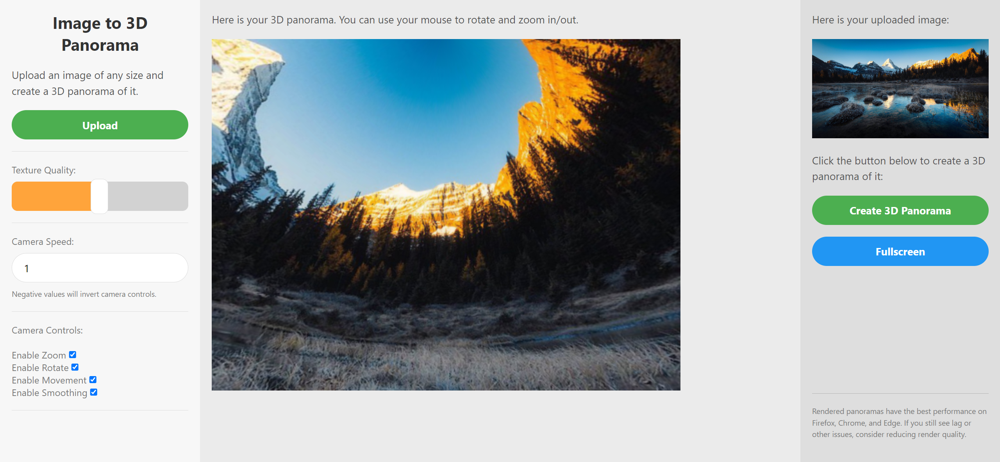

# Image to 3D Panorama: Lookaround

Lookaround is a website-based neat tool to help you see your image in a 360-degree panorama-like view, also giving you useful customization opportunities. The tool is designed to be as user-friendly and intuitive as possible, so you can get the best results with minimal effort!

## Get started

> [!NOTE]
> No installation needed, the website is already up and running on Heroku. Check it out by visiting [The Website](https://lookaround-d1a8a825efef.herokuapp.com).

1. Visit the website by clicking the link above.

2. Upload your image by clicking the "Upload" button in the left sidebar.

3. Wait for the image to load and then click the "Create 3D Panorama" button on the right sidebar.

4. If the rendered panorama is not to your liking, you can adjust the settings in the left sidebar and click the "Create 3D Panorama" button again.

5. Use the built-in controls to explore the panorama and enjoy the view!

> [!TIP]
> For a better look on the panorama, you can use the "Fullscreen" button in the right sidebar to view the panorama in fullscreen mode (press `Esc` or `F11` to exit).

## Features

- **User-friendly interface**: The website looks modern and neat, the process is easy to understand and follow, and the controls are intuitive.
- **Customization**: You can adjust the settings to your liking, such as the control sensitivity, the texture quality, and the movement speed.
- **High-quality rendering**: The panorama is rendered in high quality, so you can enjoy the view without any pixelation or distortion. (Although there will still be the occasional vertical line artifact, which is a known issue when rendering 3D panoramas from 2D images.)

## How it works?

Quite simply, actually! The website uses the [Three.js](https://threejs.org/) library to render the 3D panorama. The image is projected onto a sphere, and the user can look around the sphere using the built-in controls (some of them can be enabled or disabled using the settings on the left sidebar). The controls are also provided by Three.js, and they are very intuitive and easy to use.

For the backend, the website uses the [Flask](https://flask.palletsprojects.com/en/3.0.x/) framework to handle the image upload and the file storage. The image is uploaded to the server, and then the server sends the image to the client, where it is rendered using Three.js.

> [!CAUTION]
> The website DOES store the images on the server, but they are deleted after an hour. The website also does not store any personal information about the users, and it does not use cookies or any other tracking technologies.

## The interface

The website has a modern stylized interface with a horizontal-ish layout and a eye-friendly color scheme. Everything is divided into sections so getting into the flow of using the web tool is incredibly easy. The left sidebar contains the settings and the upload button, and the right sidebar contains the controls for the 3D panorama.

## Performance

The website has been tested on a couple of devices and it runs decently, but other benchmarks are appreciated if you're willing to provide some!

<!-- I hate making tables -->

### Specs:

- **Laptop High 1**: Intel Core i7-13700H, 16GB RAM, NVIDIA GeForce RTX 4060 8GB Laptop GPU, 512 GB SSD, Windows 11, 2K 240Hz display
- **Desktop Mid 1**: Intel Core i5-i5-7500, 16GB RAM, NVIDIA GeForce GTX 1050 Ti 4GB, 256GB SSD, Windows 10, 2K 165Hz display

| Device | Browser | Performance | Highest Texture Quality |
| ------ | ------- | ----------- | ------ |
| Laptop High 1 | Chrome | Very High, but decreases slightly when recreating the panorama a few times | Maximum |
| Laptop High 1 | Firefox | Exceptionally High | Maximum |
| Laptop High 1 | Edge | Exceptionally High | Maximum |
| Desktop Mid 1 | Chrome | Medium-High, but decreases slightly when recreating the panorama a few times | Maximum |
| Desktop Mid 1 | Firefox | High | Maximum |
| Desktop Mid 1 | Edge | High | Maximum |

> [!NOTE]
> The browser performance is based on the smoothness of the controls and the rendering speed. The texture quality is based on the quality of the image projected onto the sphere.

> [!WARNING]
> The browser version can also have a significant impact on the performance of the WebGL (Three.js) rendering. For example, the performance on the latest version of Chrome is significantly better than on the previous versions.

## Known issues

- **Vertical line artifact**: When rendering the panorama, there will be a vertical line artifact that appears in the middle of the panorama. This is a known issue when rendering 3D panoramas from 2D images, and it is caused by the way the image is projected onto the sphere. It is not a major issue, but it can be a bit distracting.

## Contributing

If you want to contribute to the project, you can do so by forking the repository and then creating a pull request. You can also open an issue if you find a bug or have a feature request.

Additionally, you can contribute by providing feedback, suggestions, benchmarks, or anything else that can help improve the project. Any help is appreciated!

## Licensed under the BSD 3-Clause License

Copyright (c) 2024, Lyubomir Ternavskiy. You can always find the full license in the [LICENSE](LICENSE) file, but here are the main points:

### What you can do:

- Use the app for anything, even commercial purposes.
- Distribute or sell the app, with or without modifications.
- Use the app as part of a larger project, with or without modifications.

### What you can't do:

- Remove the copyright notice from the app.
- Hold the author liable for any damages caused by the app.
- Use the author's name or the names of the contributors to endorse or promote products derived from the app without specific prior written permission. (sorry for the legal mumbo-jumbo)
- Use the app for anything illegal.

### What you must do:

- Keep this license and the copyright notice in the app (if you copy-paste the license, you're good to go). The license needs to be available to anyone who uses the app, either via the source code or a tab/link in the app itself.
- Include a notice that the app is licensed under the BSD 3-Clause License in any documentation or other materials provided with the app.
- Mention the original source of the app if you modify it, and include a notice that this version is modified.

## Acknowledgements

- [Three.js](https://threejs.org/) for the amazing 3D rendering library. It's a bit complex, but it's worth it!
- [Flask](https://flask.palletsprojects.com/en/3.0.x/) for the simple and powerful backend framework.
- [Heroku](https://www.heroku.com/) for the free hosting available to students, thank you guys!
- [GitHub](https://github.com/) for letting me host the code and the documentation for free, also for the amazing platform in general.

## Contact

If you have any questions, suggestions, or anything else you want to share, you can contact me at:

- Email: `ternavski103@gmail.com`
- Discord: `@lyubomirt`
- By creating a Discussion in the repository
- My Discord server: [The Orange Squad](https://discord.gg/4nVVhh29E3)

I'm always open to feedback and suggestions, so don't hesitate to reach out!
